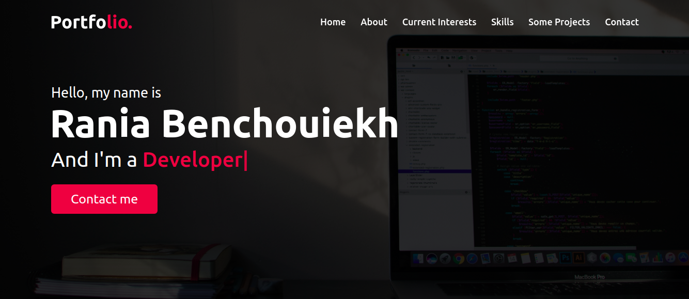
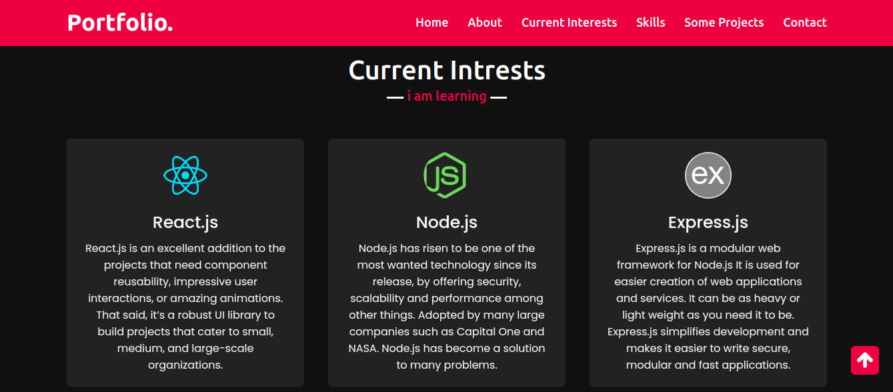
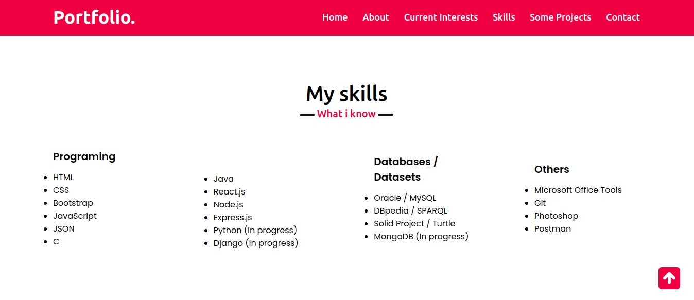
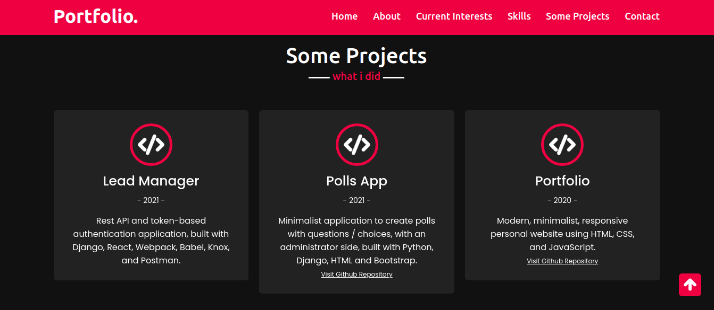
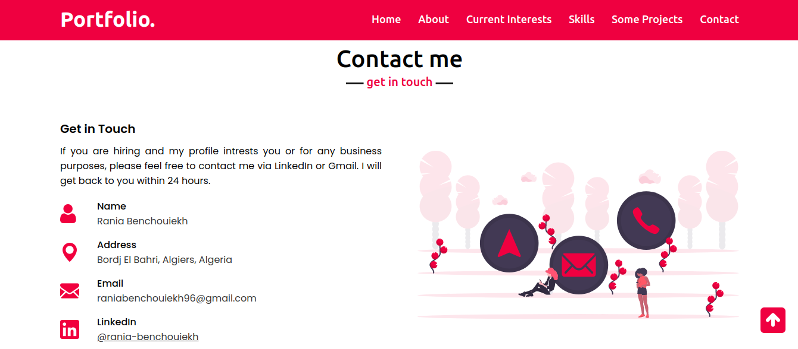

# professional-portfolio

A modern, professional and responsive Portfolio. Created using HTML, CSS, and JavaScript.

## Screenshots

Here are some screenshots.

<table>
  <tr>
    <td><b>Home page</b></td>
    <td><b>Interests page</b></td>
  </tr>
  <tr>
    <td></td>
    <td></td>
  </tr>
  <tr>
    <td><b>Skills page</b></td>
    <td><b>Projects page</b></td>
  </tr>
  <tr>
    <td></td>
    <td></td>
  </tr>
   <tr>
    <td><b>Contact page</b></td>
  </tr>
  <tr>
    <td></td>
  </tr>
 </table>
 
## Languages

<ul>
  <li>HTML</li>
  <li>CSS</li>
  <li>JavaScript</li>
</ul>

## Run and deploy the projet

To run the project, you can simply open it with Live Server in your browser like any HTML file. 
You can use [**Github Pages**](https://pages.github.com/) to deploy your project, since the project is simple and does not include a backend.
